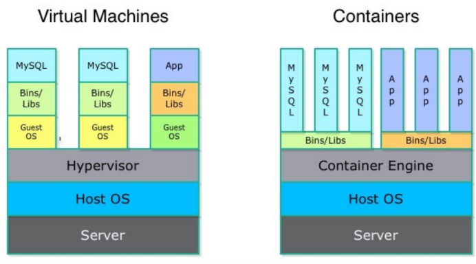

class: middle, center

background-image: url(images/background.svg)

.big[# **Big Data**]

---
class: middle
.pull-left[
## Overview

* Big Data
	* MapReduce/Hadoop
	* Tools
		* Hadoop streaming
		* Pig
		* MrJob	
		* Spark
* Docker

* Machine Learning (TBD)
	* Clustering
	* Regression
	* Decision trees
	* k-means
]
.pull-right[
### Add-on

* Veusz

* Go

]


<!--* Machine Learning
	* Clustering
	* ...-->


---
class: middle
## Sources

* Cineca
* Coursera
* Me :P

## Disclaimer

* I'm not (yet?) a data scientist
* I can be wrong
* I can be not precise
* I can be no neutral/impartial/unbiased
* This presentation started as a summary of a Big Data workshop and expanded

---
## Big Data?

.center[]

.right[-Dan Ariely-    
.small[(Israeli American professor of psychology and behavioral economics.)]]

---
class: middle
## What changed? What is about?

* The bottleneck: from find the data to analyze and store it

* From R.small[(elational)]D.small[(ata)]B.small[(ase)]M.small[(anagement)]**S**.small[(ystems)] to noSQL (huge, simple tables)

* Huge datasets, sometimes easy math/analysis

* They may not fit in a single computer

* Standardize data

* Ad hoc analysis, repurposing, visualization

.right[
## Examples
]

* Apache Point telescope, SDSS: 80TB of raw image data

* Large Synoptic Survey Telescope (LSST): 40TB/day (an SDSS every two days), 100+PB in its 10-year lifetime

* Illumina HiSeq 2000 (DNA) Sequencer: ~1TB/day 

---
class: middle

> "You are not going to analyze our upcoming data with SuperMongo" *

> “Ask not what data you need to do your science, ask what science you can do with your data.” 

.right[Zeljko Ivezic]
 .small[.citation[\*("The point is to have a good story, it's not important that it is completely true..." - [Doug](http://en.wikipedia.org/wiki/Douglas_N._C._Lin))]]

---

## MapReduce/Hadoop

* MapReduce: paradigm formalized by Google
* Hadoop: open source implementation
* The idea: 

.center[]

---

### Phases

* **Preprocessing/Input**

* **Map:** produces a (key, value) pair for each input
```
function map(String name, String line):
	for each word w in line: 
		emit (w, 1)
```

* **Shuffle:** worker nodes redistribute data based on the output keys (produced by 
the "map()" function), such that all data belonging to one key is located on the same worker node

* **Reduce:** iterate through the values that are associated with that key and produce the result
```
function reduce(String word, Iterator partialCounts):
	sum = 0
	for each pc in partialCounts:
		sum += ParseInt(pc)
		emit (word, sum)
```

* **Postprocessing/Output**

---
## Example: word count, bash pipes

```
$ cat lorem.txt 
Lorem ipsum dolor sit amet, consectetur adipiscing elit, sed do eiusmod tempor 
incididunt ut labore et dolore magna aliqua. ...
```

```bash
cat lorem.txt | tr ' ' '\n' | sort | uniq -c |  awk '{print $2" "$1}'
```

```
ad 1
adipiscing 1
aliqua. 1
aliquip 1
amet, 1
anim 1
aute 1
cillum 1
...
```

---
## Example: word count, bash pipes

```bash
cat lorem.txt | tr ' ' '\n' | sort | uniq -c |  awk '{print $2" "$1}'
```

* **Map:** 
```bash
tr ' ' '\n'
```

* **Shuffle:**
```bash
sort
```

* **Reduce:**
```bash
uniq -c |  awk '{print $2" "$1}'
```

---
class: middle
## Example: word count, python map/reduce

```python
def mapper(key, line):
	for word in line.split(' '):
*		yield word.lower(), 1

def reducer(word, occurrences):
*	yield word, sum(occurrences)
```
---
class: middle
### When use MapReduce

* Huge plain datasets (Sequenced DNA, twits, **stars?**)

* "Simple (enough) analysis"

* Batch processing

### When not

* You need great optimization (NO n-body simulations!!)

* Complex queries

* You need random data access

* Sensitive data

---
class:middle
### MapReduce pros

* It takes care of distributing data and computations, balancing, ....

* Fault tolerance

* Can be easier than the raw approach

### MapReduce cons

* Can be difficult express a problem in MapReduce

* Your problem has to be "chunckable" (and parallelizzable) both in data and computation

* No "in-memory" (but see Spark!!)

---
class: middle
### No

```
(Particle
  i = 107550
  N = 1
(Log
)Log
(Dynamics
  t  =  1
  m  =  5.04043958617598494e-05
  r  =  -0.039914815010452756 -0.23849819462867336 0.211137382273392654
  v  =  0.525312613606051082 0.26782579370738907 0.0223701434461877173
  a  =  388.665708005428314 -724.482504419982433 -2974.96707212924957
  pot  =  -1.75100076198577881
  dt =  3.814697265625e-06
  R_eff  =  2.56542922653037477e-09
```
### Yes

```
#[('Z', '|S5'), ('n', int), ('bin_id', '|S60'), ('sys_time', '<i8'), ('phys_time',  ... ... 
010, 0, Z010n000idsa108125+8125b4098, 114, 103.142412, 4098|108125+8125, S, bh|bh,  ... ... 
010, 0, Z010n000idsa108125+8125b4098, 115, 104.04717, 108125+8125|4098, S, bh|bh, 1 ... ... 
010, 7, Z010n007idsa1734b644, 94, 83.406952, 1734|644, S, bh|bh, 9.764513601, 38.59 ... ... 
010, 7, Z010n007idsa4393b644, 96, 85.181568, 644|4393, S, bh|bh, 38.597769464100004 ... ... 
010, 7, Z010n007idsa4393b644, 97, 86.068876, 644|4393, S, bh|bh, 38.597769464100004 ... ... 
...
```

---
class: middle
## Tools

* **Pig, HIVE:** translate sql-like syntax into Hadoop bytecode: data flows and relational algebra into MapReduce

* **Hadoop Streaming:** Allows to create and run MapReduce jobs with any executable or script as the mapper and/or the reducer 
```bash
$ hadoop jar $HADOOP_HOME/hadoop-streaming.jar \
-input myInputDirs \
-output myOutputDir \
*-mapper mapper.py   # or watever executable you want \
*-reducer reducer.py # or watever executable you want 
```

---

## Tools
* **MrJob:** Python module built on top of Hadoop Streaming
```python 
class myjob(MRJob):
	def mapper(self, _, line):
		pass
	def combiner(self, key, values):
		pass
	def reducer(self, key, values):
		pass
	def steps(self):
		return [ MRStep(mapper=self.mapper, ... ), 
					..., 
				]
```
```bash
$ python sqlite_job.py -r inline --database=/etc/my_db.sqlite3
$ python sqlite_job.py -r local --database=/etc/my_db.sqlite3
$ python sqlite_job.py -r hadoop --database=/etc/my_db.sqlite3
$ python sqlite_job.py -r emr --database=/etc/my_db.sqlite3
```
* `inline`: pure python, test the steps
* `local`: simulate Hadoop locally
* `hadoop`: run on Hadoop cluster (even on your laptop but you need Hadoop running)
* `emr`: run on AWS

---

## Tools


* **Spark/PySpark**: in memory (faster, interactive, ...)    

```python
$ IPYTHON=1 pyspark MASTER=local[2] 

In [1]: nums = sc.parallelize([1,2,3])  

In [2]:  squares = nums.map(lambda x: x*x)

In [3]:  squares
Out[3]: PythonRDD[2] at RDD at PythonRDD.scala:43 
# spark recorded the lineage of the computation but didn't performed it

In [4]:  even = squares.filter(lambda x: x % 2 == 0) 

In [5]: even   
Out[5]: PythonRDD[3] at RDD at PythonRDD.scala:43

In [6]: even.collect() # now the computations are launched
```

* PySpark + Pandas + GPUs, ...

---
class: middle
### What if...

* ... you have access to a Hadoop cluster and you want a one-off quick-and-dirty job...
	$\Rightarrow$ **Hadoop Streaming**
	
* ... you don’t have access to Hadoop and want to try stuff out...
	$\Rightarrow$ **MrJob**

* ... you’re heavily using AWS...
	$\Rightarrow$ **MrJob**
	
* ... you want to work interactively...
	$\Rightarrow$ **PySpark**
	
* ... you want to do in-memory analytics...
	$\Rightarrow$ **PySpark**
	
* ... you want to do anything...
	$\Rightarrow$ **PySpark**
	
* ... you want ease of Python with high performance
	$\Rightarrow$ **Impala + Numba**


---
background-image: url(images/docker.png)

---
class: middle
.center[
## What is docker?
]
> "An open source project to pack, ship and run any application as a lightweight container."
.right[.citation[[Sam Saffron](http://samsaffron.com/archive/2013/11/07/discourse-in-a-docker-container)]]

---
class: middle
### In short

* Isolated sharable environment (dev and ship)

* No need to mess-up host OS to change dev env

* No need to get mad to install an app

* Based on `lxc` ([linux containers](http://en.wikipedia.org/wiki/LXC)) and Go

* No virtual machines $\rightarrow$ lightweight

* Secure (sandbox)

* Commit changes

* Images and containers: templates and running instances* 


.small[.right[*(loose memory on shutdown)]]
---

## Docker structure



---
class:middle
### Example: run PySpark without installing it
```bash
$ docker run -v ~/Code/CinecaBigData/course-exercises-github:/course-excercises \
  -i -t cineca/hadoop-spark:1.1.0 /etc/bootstrap.sh -bash

Unable to find image 'cineca/hadoop-spark:1.1.0' locally
Pulling repository cineca/hadoop-spark
8fa0db8005ca: Pulling dependent layers 
511136ea3c5a: Download complete 
01bf15a18638: Download complete 
30541f8f3062: Download complete 
e1cdf371fbde: Download complete 
...
###################################
 The system is being inizialized...
###################################

  > Hadoop 2.5.2 <
...
```

---
class:middle
### Example: run PySpark without installing it
```bash

root@b4b21d6e88f8:/# IPYTHON=1 pyspark MASTER=local[2] 
...
Spark assembly has been built with Hive, including Datanucleus jars on classpath
14/12/16 09:03:46 INFO spark.SecurityManager: Changing view acls to: root,
...
14/12/16 09:03:48 INFO util.AkkaUtils: Connecting to HeartbeatReceiver: 
   akka.tcp://sparkDriver@b4b21d6e88f8:45534/user/HeartbeatReceiver
Welcome to
      ____              __
     / __/__  ___ _____/ /__
    _\ \/ _ \/ _ `/ __/  '_/
   /__ / .__/\_,_/_/ /_/\_\   version 1.1.0
      /_/
Using Python version 2.7.6 (default, Mar 22 2014 22:59:56)
SparkContext available as sc.

In [1]: nums = sc.parallelize([1,2,3])  
In [2]:  squares = nums.map(lambda x: x*x)
In [3]:  squares
Out[3]: PythonRDD[2] at RDD at PythonRDD.scala:43
In [4]:  even = squares.filter(lambda x: x % 2 == 0) 
In [5]: even   
Out[5]: PythonRDD[3] at RDD at PythonRDD.scala:43
In [6]: even.collect() # now the computation is launched
...
```
---
class:middle
### Example: StarLab
We want to: 

* create a docker container

* install StarLab

* run StarLab on the host GPU 

* Retrieve the results.

---
class:middle
### Example: StarLab

* Create an EMPTY folder

* Create a [`Dockerfile`](./Dockerfile)

* Create the image by running [build](https://docs.docker.com/reference/commandline/cli/#build) (the final dot is a path, not a typo)
```bash
docker build --force-rm=true -t brunetto/starlabGPU:$(date +"%Y%m%d") .
```
* Check
```bash
docker images
```

* Create and start a container based on the new image    
(separate commands exist)
```bash
$ docker run -ti    --device /dev/nvidia0:/dev/nvidia0 \
					--device /dev/nvidia1:/dev/nvidia1 \
					--device /dev/nvidiactl:/dev/nvidiactl \
					--device /dev/nvidia-uvm:/dev/nvidia-uvm \
					-v       ~/starlab-results: /starlab-results \
					         brunetto/cuda2:20141218
```
---
class:middle
### Example: StarLab
* Check
```bash
docker ps [-a]
```

* Useful commands
```bash
docker start, stop, rm, rmi
```

* Docs: [command line](https://docs.docker.com/reference/commandline/cli/), [all](http://docs.docker.com/), [me](https://github.com/brunetto/docker-cheat-sheet)

---
### Install Docker 
.citation[see [here](https://github.com/brunetto/docker-cheat-sheet#linux)]

* Add docker repository key to apt-key for package verification and add repository:
```bash
sudo sh -c "wget -qO- https://get.docker.io/gpg | apt-key add -"
sudo sh -c "echo deb http://get.docker.io/ubuntu docker main\
> /etc/apt/sources.list.d/docker.list"
```
* Install docker
```bash
sudo aptitude update && sudo aptitude install lxc-docker
```
* Avoid typing `sudo` everytime
```bash
sudo groupadd docker
sudo gpasswd -a ${USER} docker
sudo service docker restart
```
then logout and login again.

---
class: middle
.center[
# Veusz
]
.citation[[https://github.com/jeremysanders/veusz](https://github.com/jeremysanders/veusz):]

> Veusz is a scientific plotting package.  It is designed to produce
> publication-ready Postscript, PDF or SVG output. Graphs are built-up
> by combining plotting widgets. The user interface aims to be simple,
> consistent and powerful.
> 
> Veusz provides GUI, Python module, command line, scripting, DBUS and
> SAMP interfaces to its plotting facilities. It also allows for
> manipulation and editing of datasets. Data can be captured from
> external sources such as Internet sockets or other programs.

---
background-image: url(images/veusz.png)

---
## Example

.citation[(from [http://brunettoziosi.eu/posts/python-plot-examples.html](http://brunettoziosi.eu/posts/python-plot-examples.html))]

```python
import veusz.embed as ve

doc = ve.Embedded("doc_1")
page = doc.Root.Add('page', width = '30cm', height='15cm')
grid = page.Add('grid', autoadd = False, rows = 1, columns = 2, ...)
graph = grid.Add('graph', name="scatter", autoadd=False, ...)
axx = Add('axis', name='x', label = "x", ...)
axy = Add('axis', name='y', label = "y", ...)

graph.Add('xy', key="scatterPlotKey", name='scatterPlotName', ...)
xDataName = "xScatterData"
yDataName = "yScatterData"
doc.SetData(xDataName, xData)
doc.SetData(yDataName, yData)
graphList[0].scatterPlotName.xData.val = xDataName
graphList[0].scatterPlotName.yData.val = yDataName

key = graph.Add('key', autoadd=False, ...)

doc.Save("example.vsz")
doc.Export("example.png", backcolor='#ffffff')
doc.Export("example.pdf") # best pdf ever seen, also available svg, eps, ...
```

---
## Let's wrap it


---

## Veusz file

```
...
Set('width', '30cm')
Set('height', '15cm')
Add('grid', name='grid1', autoadd=False)
To('grid1')
Set('rows', 1)
Set('columns', 2)
Set('scaleRows', [0.2])
Set('topMargin', '1cm')
Set('bottomMargin', '1cm')
Add('graph', name='scatter', autoadd=False)
To('scatter')
Set('hide', False)
Set('leftMargin', '0.6cm')
Set('rightMargin', '0.4cm')
...
```
---
### Pros 

* Pythonic scripting interface (more pythonic tha `matplotlib`)

* GUI

* You can write a `.vsz` file and open it with the GUI to adjust/change/hide/...

* Best pdf/eps/svg ever seen (thank you, QT)

* Multipage pdf

* Integrated datasets

* SM-like syntax still available (if you really can't avoid it)

.right[
### Cons
]

* A little verbose (but easy to wrap and hide that)

* Sometime difficult to find how to do something

* Different version sometimes has broken old scripts


---
background-image: url(images/golang.png)

---
class: middle
## Golang 

.citation[from [golang.org](golang.org)]

> Go is an open source programming language that makes it easy to build simple, reliable, and efficient software.
.center[
### Motivation/introduction
]

A simple but powerful and fun language.
* start with C, remove complex parts
* add interfaces, concurrency
* also: garbage collection, closures, reflection, strings, ...

For more background on design:
* [Less is exponentially more](http://commandcenter.blogspot.it/2012/06/less-is-exponentially-more.html)
* [Go at Google: Language Design in the Service of Software Engineering](http://talks.golang.org/2012/splash.article)
* Born during a C++ compilation    
.small[.citation[("The point is to have a good story, it's not important that it is completely true..." - [Doug](http://en.wikipedia.org/wiki/Douglas_N._C._Lin))]]

---
class: middle
.center[
## Go in short
]
.citation[from [Andrew Gerrand talk](http://talks.golang.org/2012/zen.slide)]

* A simple language that is easy to learn and read.

* Statically typed, but with a dynamic feel.

* Compiled to native machine code, but has a fast development cycle.

* Language-level concurrency features.

* Expansive "batteries included" standard library.

* Great tools.

---
class: middle
.center[
## It's pythonic (more thank python)
]
.small[
> The Zen of Python, by Tim Peters
> 
> * Beautiful is better than ugly.
> * Explicit is better than implicit.
> * Simple is better than complex.
> * Complex is better than complicated.
> * Flat is better than nested.
> * Sparse is better than dense.
> * Readability counts.
> * Special cases aren't special enough to break the rules.
> * Although practicality beats purity.
> * Errors should never pass silently.
> * Unless explicitly silenced.
> * In the face of ambiguity, refuse the temptation to guess.
> * There should be one-- and preferably only one --obvious way to do it.
> * Although that way may not be obvious at first unless you're Dutch.
> * Now is better than never.
> * Although never is often better than *right* now.
> * If the implementation is hard to explain, it's a bad idea.
> * If the implementation is easy to explain, it may be a good idea.
> * Namespaces are one honking great idea -- let's do more of those!
]

---

### My 2 cents


* Build, install, run (build + launch) super-fast

* Python-like imports, no header file

```go
package slt

import (
	"bufio"
	"compress/gzip"
	"fmt"
	"log"
	"os"
	"path/filepath"
	"regexp"
	"strings"
	"time"
	
	"github.com/brunetto/goutils/debug"
)
```

---
class: middle
* Static compiling: drop everywhere (ok, not on [PLX](https://golang.org/doc/install#requirements))

```bash
$ cat test.go
package main

import (
       "fmt"
       "time"
       "github.com/brunetto/goutils/debug"
)

func main() {
     defer debug.TimeMe(time.Now())
     fmt.Println("hello, world!")

$ go build test.go

$ file test
test: ELF 64-bit LSB  executable, x86-64, version 1 (SYSV), 
   statically linked, not stripped

$ ldd test
        not a dynamic executable
```

---
class: middle

* It forces you to program better

* Standard (even the source formatting): 

```bash 
go fmt -w yoursource.go`
```
* Uncompromising compiler: if it compiles, 99.999% it is ok

```bash
$ go build test.go 
# command-line-arguments
./test.go:4: imported and not used: "log"
./test.go:13: undefined: b
```

* Handle errors where they happen

```go
if outFile, err = os.Create(outFileName); err != nil {
	log.Fatal("Can't create outfile with error: ", err)
}
```

---
class: middle

* Straightforward parallelization

```go
// Start concurrent goroutines
for idx:=0; idx,2: idx++ {
	go slt.Out2ICs(fileNameChan, cssInfo)
}

// Feed goroutines
for fileName = range fileNames {
	fileNameChan <- fileName
}
close(fileNameChan)

// Discard start scripts information and shutdown
<-cssInfo
```

* Smart workspace/source/packages organization 

* Everything you need except for `numpy`/`scipy/matplotlib`-like libraries (but they are [work in progress](https://github.com/gonum))

* Scientific computing/GPU? Work in progress (see [here](http://mumax.github.io/), [here](https://github.com/sbinet))

* Everything else is already there

* Super-active [community](https://groups.google.com/forum/#!forum/golang-nuts)

---
class: middle
### Bye

```go
package main

import "fmt"

func swap(x, y string) (string, string) {
	return y, x
}

func main() {

	var a, b = "世界", "Byebye" // Yes, it's Unicode
	fmt.Println(swap(a, b))
}
```
`Byebye 世界`


---
class: middle
Brunetto Ziosi
<brunetto.ziosi@gmail.com>    
[https://github.com/brunetto](https://github.com/brunetto)    
[brunettoziosi.eu](brunettoziosi.eu)    


